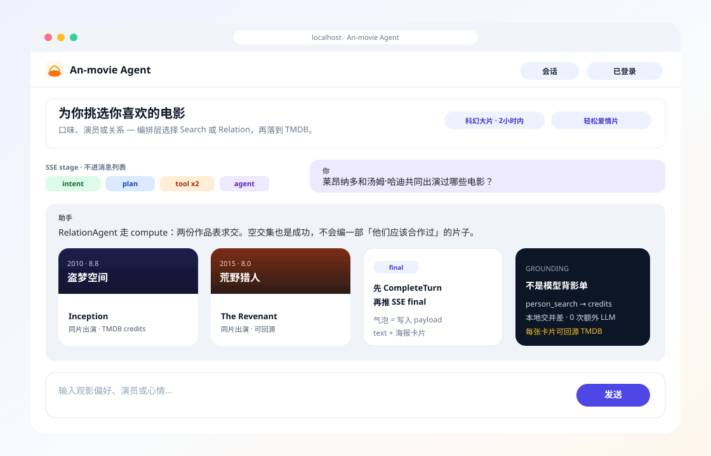
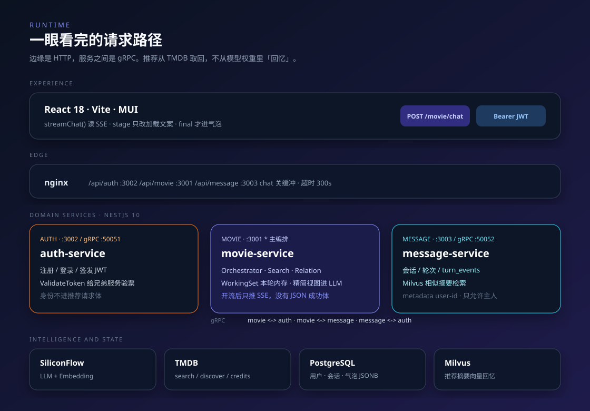
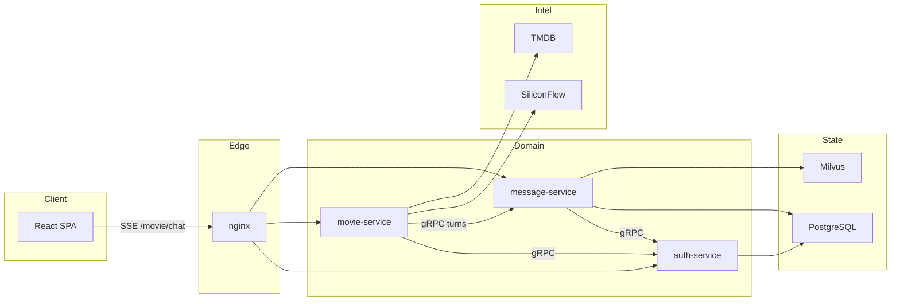
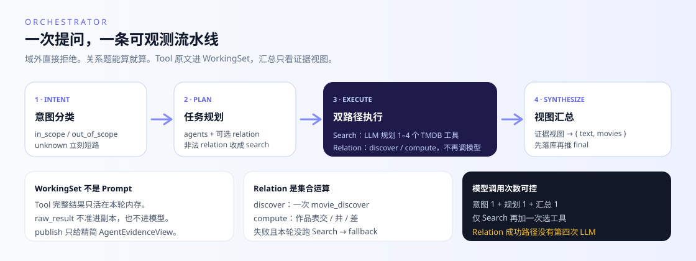

<p align="center">
  
</p>

<h1 align="center">An-movie Agent</h1>

<p align="center">
  <b>自然语言进，可回源的电影推荐出。</b><br/>
  多 Agent 编排 · TMDB Tool Calling · 确定性关系运算 · SSE 可观测流水线
</p>

<p align="center">
  <a href="https://github.com/renshengyiyijihe/noodle-recommendation-agent/actions/workflows/ci.yml"></a>
  
  
  
  
  
</p>

多数「AI 荐片」把用户那句话丢进一次 LLM 补全，片子从模型权重里编出来。这个仓库做的是另一件事：**把推荐做成可编排、可核验、可观测的工作流**。

意图分类挡住域外请求；任务规划在 Search 与 Relation 之间做路由；检索必须落到 TMDB；人物合作、作品表交并差走本地集合运算，不再为算交集多烧一次模型。过程经 SSE 推给前端，结论先写入会话，再推 `final`。

一句话：**Planner–Executor，而不是 Chat Completion 套壳。**

---

## Demo

本地 `docker compose up --build` 之后打开 [http://localhost](http://localhost)，登录，丢一句口味进去。

<p align="center">
  
</p>

| 你说 | 系统实际走的路 |
| --- | --- |
| 「想看一部科幻大片，时长 2 小时以内」 | `SearchAgent` 规划 `movie_discover`，按类型 / 时长 / 评分填 schema |
| 「莱昂纳多和汤姆·哈迪共同出演过哪些？」 | `RelationAgent` · `compute`：两份作品表求交，**成功路径 0 次额外 LLM** |
| 「诺兰当导演、汉斯·季默配乐的片子」 | `RelationAgent` · `discover`：解析 person_id 后一次 `with_crew` |
| 「帮我写今天的作业」 | `intent = out_of_scope`，直接 `reject`，不装全能助手 |

过程对用户可见，但不污染聊天记录：

```text
event: turn     会话与轮次 id
event: stage    intent → plan → tool* → agent   ← 只改加载文案
event: final    先 CompleteTurn，再推；气泡 = 写入的 payload
```

鉴权或 DTO 失败仍返回 JSON `{ code, message }`，**不开流**。开流之后没有 JSON 成功体。契约在 [`packages/contracts/src/stream.ts`](packages/contracts/src/stream.ts)。

---

## 为什么值得看

这不是功能清单，是这个仓库愿意写进 README 的工程判断。

**Grounded generation，不是影单幻觉。**  
每张卡片来自 TMDB `search` / `discover` / `credits`。模型负责路由与措辞，不负责「记得一部片子」。空交集是成功：视图里 `movies: []`，汇总如实说没有，不会补一部「他们应该合作过」的片。

**双路径 Agent，而不是万能 Prompt。**  
`SearchAgent` 用 LLM 规划 1–4 个 tool call，按 JSON Schema 校验参数。`RelationAgent` 吃规划阶段一次给全的 `RelationPlan`，`discover` 或 `compute`，**不再调模型，也不回调 Search**。规划不合法就收成 search，不会让整轮 Zod 炸三次。

**WorkingSet / Evidence View。**  
Tool 的结构化结果进本轮内存工作副本；`raw_result` 不准进副本，也不进 prompt。汇总只看精简 `AgentEvidenceView`。这是 context engineering，不是把 TMDB 整包 `JSON.stringify` 塞进上下文。

**SSE 是产品，不是日志尾巴。**  
`turn_events` 写入时间线，再投影成 `stage`。前端加载文案跟着 `intent / plan / tool / agent` 走，完整 Tool 结果不出浏览器。先落库再推 `final`：刷新之后气泡还在，不会「流成功了、库是空的」。

**微服务切得干净。**  
三个独立 NestJS 进程：鉴权、编排、会话记忆。服务间 gRPC，身份走 metadata `user-id`，请求体不传 `user_id`。错误码、气泡、SSE 帧在 `@an-movie/contracts` 一份契约，前后端编解码各写一次。

**会话是有主人的。**  
同一会话同时只能有一个 `running` 轮次。无主会话、越权一律当不存在。僵死轮次 10 分钟清扫成 `error`。推荐摘要异步进 Milvus，失败不阻断主路径。

**可运行，而不只是可演示。**  
`/health` 活着，`/ready` 才给 Compose 探活，`/metrics` 给 Prometheus。Grafana 总览盘随仓库预置。push `main` 先跑 lint + 四包 build，通过再 SSH 部署。

---

## 架构

<p align="center">
  
</p>

浏览器只打 HTTP。`movie-service` 是编排中枢：对上开 SSE，对下 gRPC 找会话、HTTP 打 LLM 与 TMDB。`message-service` 不解析 Agent kind，只存 JSONB 时间线。`auth-service` 发 JWT，并给兄弟服务验票。



Prometheus 刮三个 `/metrics`，Grafana 查 Prometheus。这两个口和 `/health` `/ready` 一样，nginx 都不反代。

---

## Agent 工作流

<p align="center">
  
</p>

已注册 TMDB 工具：`movie_search` · `movie_discover` · `movie_detail` · `person_search` · `person_detail`。`poster_path` 保持相对路径，域名前缀由前端拼。

模型次数是预算，不是「能调多少调多少」：意图 1 + 规划 1 + 汇总 1；仅 Search 再加一次选工具。Relation 成功路径没有那第四次。

---

## 技术栈

| 层 | 选型 |
| --- | --- |
| 体验 | React 18 · Vite · MUI 9 · Zustand · fetch SSE |
| 服务 | NestJS 10 × 3 · gRPC · JWT |
| 编排 | LangChain · OpenAI 兼容 SiliconFlow · Zod 收口规划 |
| 数据 | PostgreSQL · Milvus · TMDB |
| 交付 | pnpm 10.15.0 · Docker Compose · Prometheus / Grafana |

共享包 `@an-movie/contracts` / `@an-movie/auth-client` 用 `file:` 引用。根目录没有 pnpm workspace，四个应用各自 lockfile；根级 `package.json` 只做 lint / typecheck / husky / commitlint。

---

## 快速开始

准备两份环境文件（不要提交）：

- `backend/.env`：至少 `JWT_SECRET`
- `backend/movie-service/.env`：至少 `LLM_API_KEY`、`TMDB_API_KEY`

```bash
docker compose up --build
```

| 入口 | 地址 |
| --- | --- |
| 产品 | http://localhost |
| Grafana | http://localhost:3000（默认 `admin` / `yangjinhu`） |
| movie / auth / message | `:3001` / `:3002` / `:3003` |
| Portainer | http://localhost:9000 |

完整变量表、探活语义、模块边界见 [AGENTS.md](AGENTS.md)。本地单独跑 Vite（`:5173`）时默认 **没有** 把 `/api` 转到后端，需要自行配代理；Docker 下由 nginx 反代，并对 `/api/movie/chat` 关闭缓冲。

先编共享包镜像再拉栈：`docker compose build packages`，再 `up --build`。`packages` 容器启动后立刻退出，`compose ps` 里 Exited 是正常的。

---

## 仓库地图

```text
an-movie-agent/
├── client/                 # 单页：聊天、海报卡片、历史弹窗
├── backend/
│   ├── proto/              # 跨服务 .proto
│   ├── auth-service/       # 注册登录 + JWT + 验票
│   ├── movie-service/      # Orchestrator / Search / Relation / TMDB
│   └── message-service/    # 会话 · 轮次 · Milvus
├── packages/
│   ├── contracts/          # 错误码 · 气泡 · SSE 契约
│   └── auth-client/        # Guard · 异常过滤器 · request-id
├── observability/          # Prometheus + Grafana 总览盘
└── AGENTS.md               # 编码约定（给改代码的人，不是给逛 GitHub 的人）
```

对外 HTTP（经 nginx 前缀 `/api`）：

| 方法 | 路径 | 说明 |
| --- | --- | --- |
| `POST` | `/api/auth/register` · `/login` | 注册 / 登录 |
| `POST` | `/api/movie/chat` | **SSE**，需 Bearer |
| `GET/POST` | `/api/message/conversations` | 会话列表 / 新建 / 详情 |

贡献约定、Agent / Tool / Prompt 怎么加，只看 [AGENTS.md](AGENTS.md)。提交信息走 [Conventional Commits](https://www.conventionalcommits.org/)，type 以 [`commitlint.config.mjs`](commitlint.config.mjs) 为准。

---

## 现在还不会假装能做的事

开源项目把边界写清楚，比把 roadmap 写成广告更有用。

- 前端可以上传图片，Orchestrator **尚未消费** `imageData`
- Relation 不做计数、排名、多跳路径、公司 / 系列；规划应标 `unsupported` 或走 search
- 工作副本不跨请求保留；「刚才那批再筛一次」目前靠历史文本 + 重新取数
- 客户端断开不会取消工作流；轮次仍是 `running`，立刻重发会撞「上一轮还在处理」
- 鉴权白名单邮箱写死在 `AuthService.validateToken`（演示环境约束，不是通用 IAM）

---

模块怎么拆、事件怎么记、prompt 改哪一个文件：继续读 [AGENTS.md](AGENTS.md)。
